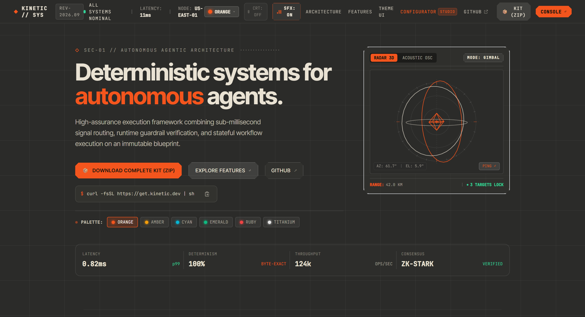
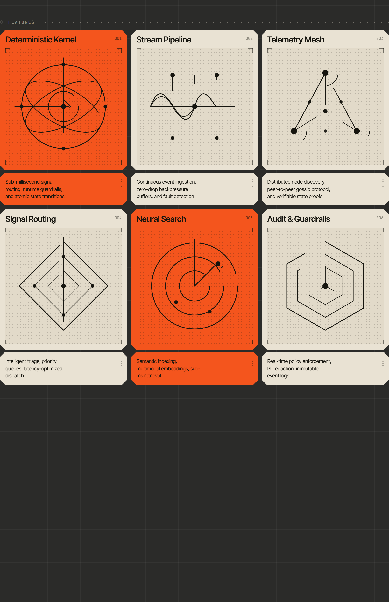
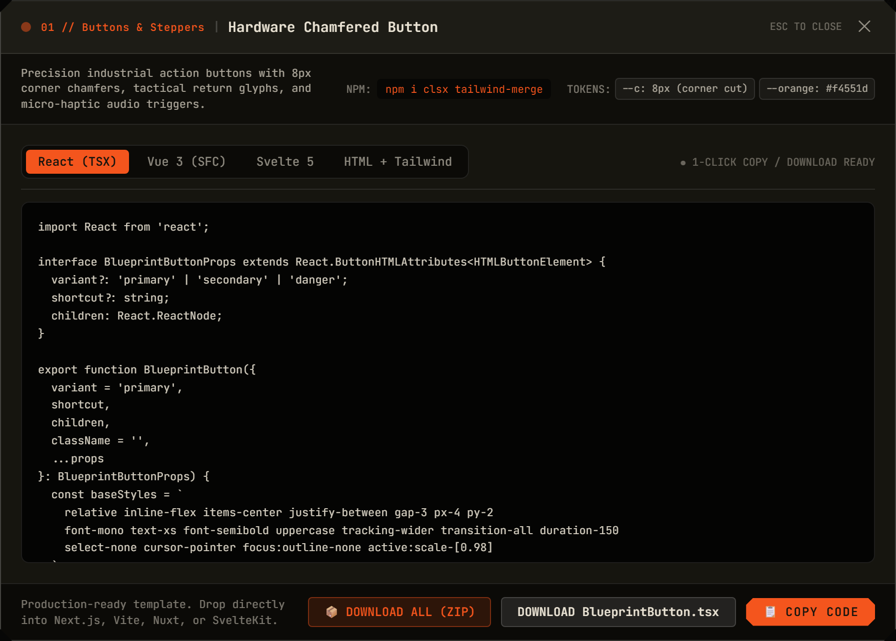
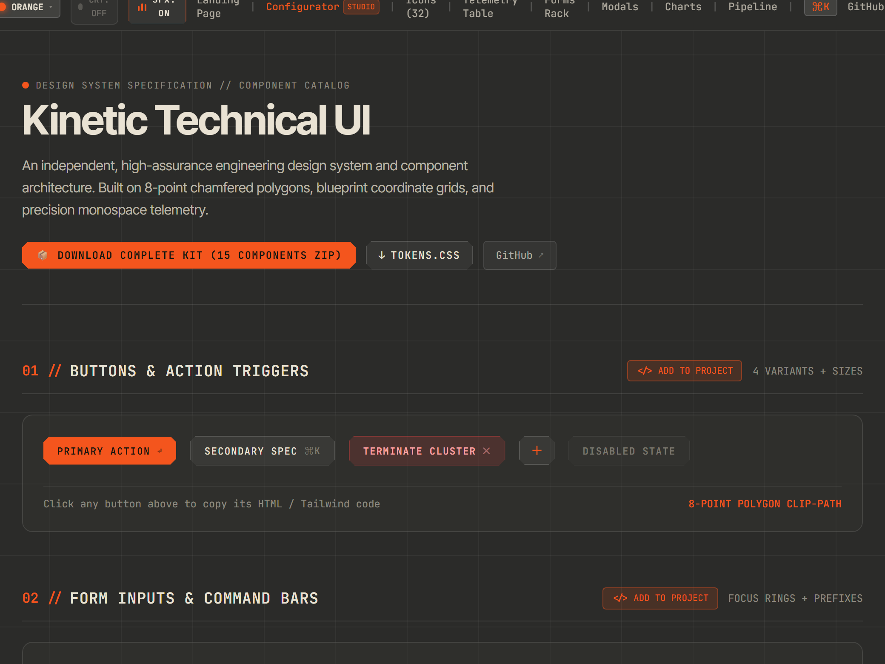
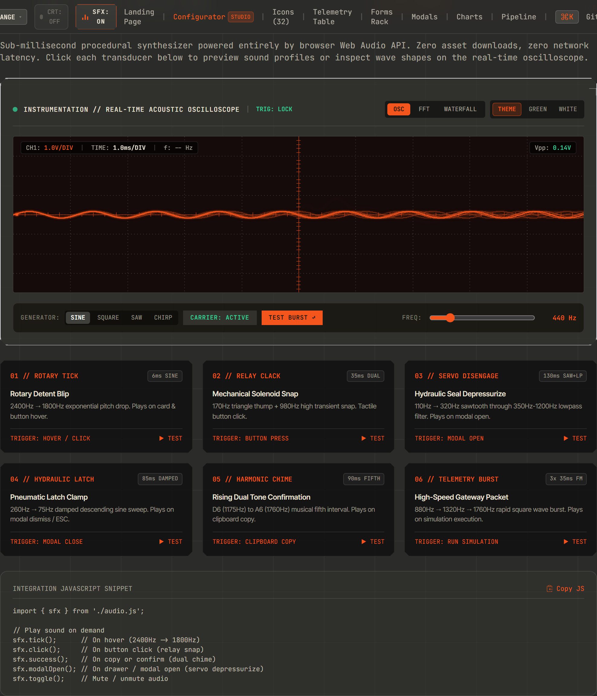
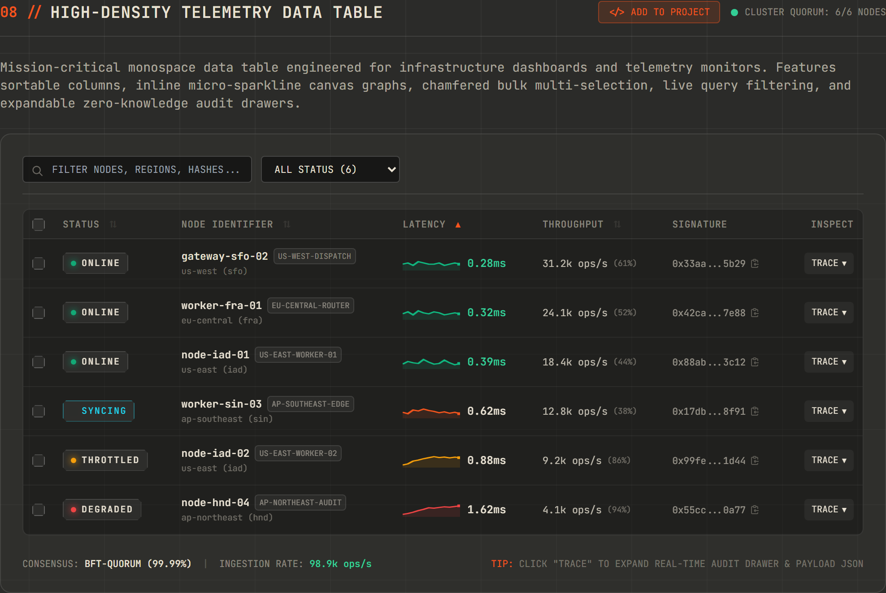
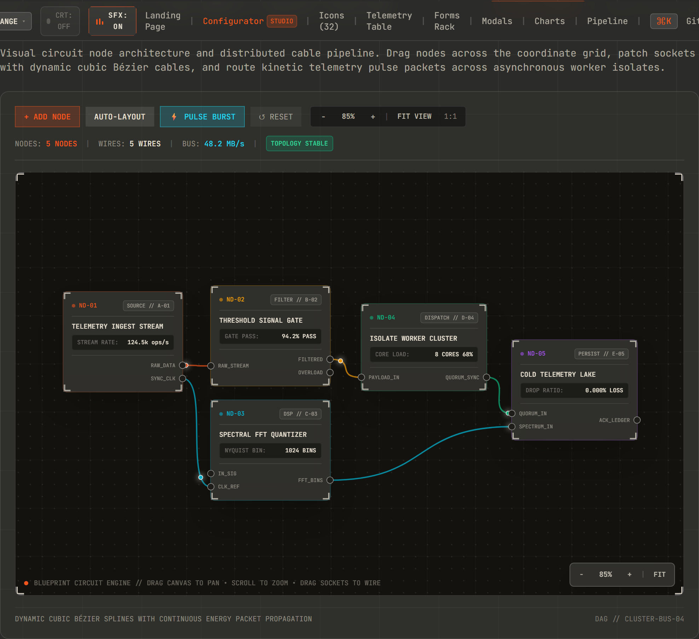
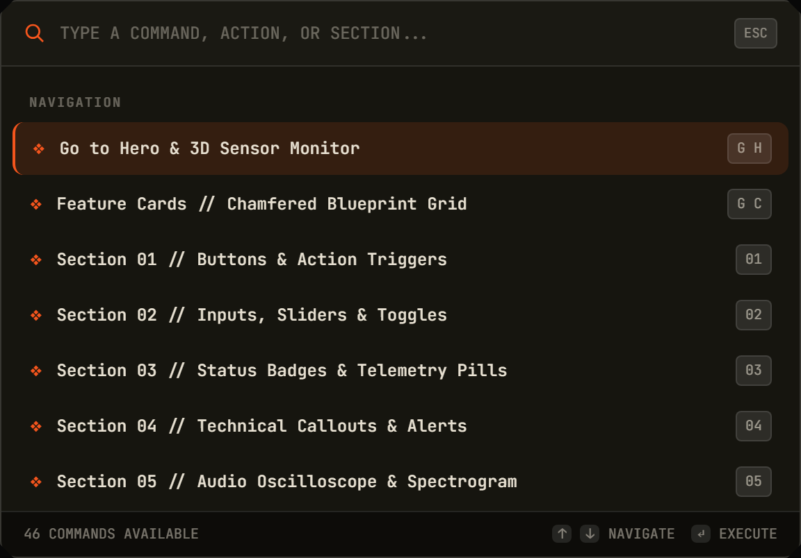

# Kinetic UI

[](https://kinetic-ui.ai.studio/)
[](https://opensource.org/licenses/MIT)
[](https://github.com/SalAkBuK/kinetic-ui)
[](https://github.com/SalAkBuK/kinetic-ui)
[](https://github.com/SalAkBuK/kinetic-ui)
[](https://github.com/SalAkBuK/kinetic-ui)

> 🚀 **Live Interactive Demo**: [**kinetic-ui.ai.studio**](https://kinetic-ui.ai.studio/) — explore the 15 components, live 3D radar, oscilloscope, and code exporter directly in your browser.

**Kinetic UI** is an independent, high-assurance industrial engineering design system and component architecture built for aerospace telemetry, mission control consoles, distributed infrastructure dashboards, and developer platforms.

Built from first principles on **8-point chamfered polygon silhouettes**, **blueprint coordinate grid canvases**, **hardware monospace typography**, **procedural Web Audio API micro-haptics**, and **zero-dependency Tailwind CSS design tokens**.

<p align="center">
  
</p>

---

## Key Capabilities

- **15 Production Components across 4 Frameworks**: Complete component implementations copy-pasteable in **React (TSX)**, **Vue 3 (SFC)**, **Svelte 5**, and **HTML5 + Tailwind CSS**.
- **Complete Suite ZIP Downloader**: 1-click client-side archive generator packaging all 60 component variants, `tokens.css`, `tailwind.config.js`, and setup documentation.
- **32 Technical Vector Glyphs**: Handcrafted 24×24 SVG icons with 1.35px stroke width, chamfer cuts, and coordinate brackets across Compute, Hardware, Security, and Interface domains.
- **Procedural Web Audio Micro-Haptics**: Zero-asset sound engine synthesizing rotary detents, solenoid relays, servo disengages, and telemetry chirps with sub-millisecond latency.
- **Tactical Theme Matrix & CRT Filter**: 6 high-contrast industrial palettes with instant DOM switching and an authentic cathode-ray phosphor scanline simulation overlay.
- **Interactive Instrumentation**: 60FPS canvas radar sensors, Tektronix-style audio oscilloscopes, FFT spectrum analyzers, tachometer dials, and dynamic Bézier node flow graphs.
- **High-Density Telemetry Data Table**: Multi-column sorting, instant query filtering, inline canvas sparklines, chamfered checkboxes, and batch CSV export.
- **Hardware Parameter Rack**: Masked secrets editor, live streaming telemetry switches, and JSON import/export presets.
- **Global Command Palette (`⌘K`)**: Fast keyboard-driven command execution, category filtering, and direct component export shortcuts.

---

## Component Suite (15 Primitives)

| # | Component | ID | Description | Output Files |
| :- | :--- | :--- | :--- | :--- |
| 1 | **BlueprintButton** | `button` | 8-point polygon chamfer action triggers with return glyphs | `.tsx`, `.vue`, `.svelte`, `.html` |
| 2 | **BlueprintInput** | `input` | Monospace coordinate form inputs with live focus indicators | `.tsx`, `.vue`, `.svelte`, `.html` |
| 3 | **BlueprintBadge** | `badge` | Status tags with radar-pulse LEDs and severity tokens | `.tsx`, `.vue`, `.svelte`, `.html` |
| 4 | **BlueprintCallout** | `callout` | Tactical warning and info callouts with corner crop brackets | `.tsx`, `.vue`, `.svelte`, `.html` |
| 5 | **useBlueprintSFX** | `audio` | Web Audio API procedural sound synthesizer hook | `.ts`, `.ts`, `.ts`, `.js` |
| 6 | **BlueprintIcon** | `icon` | 32 technical SVG vector glyphs with viewBox="0 0 24 24" | `.tsx`, `.vue`, `.svelte`, `.html` |
| 7 | **BlueprintCard** | `card` | Chamfered technical cards with dot-grid canvas & seam diamond | `.tsx`, `.vue`, `.svelte`, `.html` |
| 8 | **TelemetryTable** | `table` | Dense telemetry log grid with sparklines and status filtering | `.tsx`, `.vue`, `.svelte`, `.html` |
| 9 | **ParameterRack** | `params` | Environment variable and secrets editor with masked toggle | `.tsx`, `.vue`, `.svelte`, `.html` |
| 10 | **CommandPalette** | `command-palette` | Keyboard-first command discovery palette (`⌘K` / `Ctrl+K`) | `.tsx`, `.vue`, `.svelte`, `.html` |
| 11 | **SafetyConfirmationModal** | `modal` | Two-phase safety confirmation latch for dangerous actions | `.tsx`, `.vue`, `.svelte`, `.html` |
| 12 | **TelemetryDrawer** | `drawer` | Slide-out hardware inspector and real-time metric panel | `.tsx`, `.vue`, `.svelte`, `.html` |
| 13 | **BlueprintSparkline** | `chart` | Canvas & SVG live streaming sparkline graph | `.tsx`, `.vue`, `.svelte`, `.html` |
| 14 | **TachometerGauge** | `gauge` | Precision 270° radial tachometer dial gauge with arc fill | `.tsx`, `.vue`, `.svelte`, `.html` |
| 15 | **BlueprintNode** | `pipeline` | Flow graph circuit node with patch cable connection sockets | `.tsx`, `.vue`, `.svelte`, `.html` |

---

## Visual Previews & System Gallery

### 1. Chamfered Feature Cards Grid
Handcrafted 8-point polygon silhouettes, blueprint coordinate grid background, and orchestrated initial-load SVG line-art vector drawings.

<p align="center">
  
</p>

### 2. Multi-Framework Component Exporter (shadcn/ui style)
1-click copy-pasteable component modal with tabs for **React (TSX)**, **Vue 3 (SFC)**, **Svelte 5**, and **HTML5 + Tailwind CSS**, plus individual and full-kit ZIP downloads.

<p align="center">
  
</p>

### 3. Component Catalog & Precision Controls
Monospace form inputs, precision action buttons, steppers, status badges with radar LEDs, and tactical callouts.

<p align="center">
  
</p>

### 4. Real-Time Audio Oscilloscope & Micro-Haptics
Zero-asset procedural Web Audio API synthesizer featuring a live persistence canvas oscilloscope, frequency generator, and mechanical relay haptic triggers.

<p align="center">
  
</p>

### 5. High-Density Telemetry Data Table
Multi-column sorting, instant query filtering, inline canvas sparklines, chamfered checkboxes, and batch CSV export.

<p align="center">
  
</p>

### 6. Blueprint Node Flow Graph & Circuit Pipeline
Interactive visual canvas with movable circuit nodes, dynamic Bézier splines, socket connectors, and continuous packet propagation.

<p align="center">
  
</p>

### 7. Global Industrial Command Palette (`⌘K`)
Keyboard-driven modal discoverability with 46 actions, section jumps, color space switches, and direct component export shortcuts.

<p align="center">
  
</p>

---

## Visual Design Language & Geometry

### 1. Chamfered Polygon Silhouettes
Components use an 8-point polygon clip-path with a parameterized corner chamfer radius (`--c`):
```css
.chamfer {
  --c: 13px;
  clip-path: polygon(
    var(--c) 0, calc(100% - var(--c)) 0,
    100% var(--c), 100% calc(100% - var(--c)),
    calc(100% - var(--c)) 100%, var(--c) 100%,
    0 calc(100% - var(--c)), 0 var(--c)
  );
}
```

### 2. Blueprint Coordinate Grid
```css
.blueprint {
  background-color: #2b2b29;
  background-image:
    linear-gradient(to right, rgba(255, 255, 255, 0.045) 1px, transparent 1px),
    linear-gradient(to bottom, rgba(255, 255, 255, 0.045) 1px, transparent 1px);
  background-size: 84px 84px;
  background-position: center top;
}
```

### 3. Industrial Color Palette Matrix
- **Kinetic Orange** (`#f4551d`): Aerospace primary telemetry accent.
- **Synth Amber** (`#f59e0b`): Cathode-ray tube warm phosphor.
- **Quantum Cyan** (`#06b6d4`): Clean-room avionics instrumentation.
- **Radar Emerald** (`#10b981`): Sonar navigation and nominal telemetry.
- **Alarm Ruby** (`#ef4444`): Emergency fault lockdown and security hazards.
- **Monochrome Titanium** (`#e5e5e5`): Clean-room laboratory finish.

---

## Quick Start

### 1. Installation & Setup
```bash
# Clone the repository
git clone https://github.com/SalAkBuK/kinetic-ui.git
cd kinetic-ui

# Install dependencies
npm install

# Launch development server
npm run dev
```

### 2. Production Build
```bash
npm run build
npm run preview
```

### 3. Adding Components to Your Project (shadcn/ui style)
1. Add [`tokens.css`](./tokens.css) to your root stylesheet.
2. Extend your `tailwind.config.js` with the Kinetic UI theme tokens.
3. Open [`components.html`](./components.html), click **`[</> ADD TO PROJECT]`** on any component, select your framework (**React**, **Vue**, **Svelte**, or **HTML**), and copy or download the file directly into your codebase.
4. Or download the complete 60-file bundle by clicking **`[DOWNLOAD COMPLETE KIT (ZIP)]`**.

---

## Procedural Web Audio Engine

Kinetic UI includes a zero-asset audio synthesizer ([`audio.js`](./audio.js)) that generates mechanical micro-interactions directly through the browser Web Audio API:
- **Rotary Detent**: 6ms sine sweep (2400Hz → 1800Hz) on hover.
- **Solenoid Relay**: 35ms dual-transient mechanical clack on primary clicks.
- **Servo Disengage**: 130ms filtered sawtooth sweep on modal opening.
- **Hydraulic Latch**: 85ms descending clamp on modal dismiss.
- **Telemetry Chirp**: 3-pulse frequency-modulated burst on execution.
- **Success Chime**: Harmonic ascending fifth interval (D6 → A6) on copy/download.

Toggle audio at any time via the HUD button or press `S` in the Command Palette.

---

## Technical Icon Library (32 Glyphs)

The included icon system ([`icons.js`](./icons.js)) provides 32 vector glyphs on a 24×24 grid with 1.35px stroke weight and precision corner brackets:
- **Compute & Telemetry**: `cluster`, `shard`, `pipeline`, `qubit`, `latency`, `cpu`, `neural`, `database`.
- **Hardware & Transducers**: `rotary`, `toggle`, `oscilloscope`, `relay`, `slider`, `meter`, `fuse`, `crystal`.
- **Security & Guardrails**: `shield-zk`, `key-crypto`, `audit`, `reticle`, `vault`, `fingerprint`, `badge-check`, `hazard`.
- **Interface & Controls**: `crosshair`, `terminal`, `brackets`, `split-flap`, `chevron-chamfer`, `search-reticle`, `copy-blueprint`, `sound-wave`.

---

## Command Palette (`⌘K` Shortcuts)

Press `⌘K` or `Ctrl+K` from anywhere in the interface to open the keyboard HUD:
- `X Z`: Export Complete Design System Suite (15 Components ZIP)
- `X B`: Export BlueprintButton
- `X C`: Export BlueprintCard
- `X T`: Export TelemetryTable
- `X I`: Export BlueprintInput
- `X M`: Export SafetyConfirmationModal
- `T O` / `T A` / `T C` / `T E` / `T R` / `T M`: Switch color palette
- `C`: Toggle CRT phosphor simulation overlay
- `S`: Toggle audio micro-haptics
- `T`: Toggle slide-out telemetry drawer

---

## License

Kinetic UI is open-source software licensed under the [MIT License](./LICENSE).
